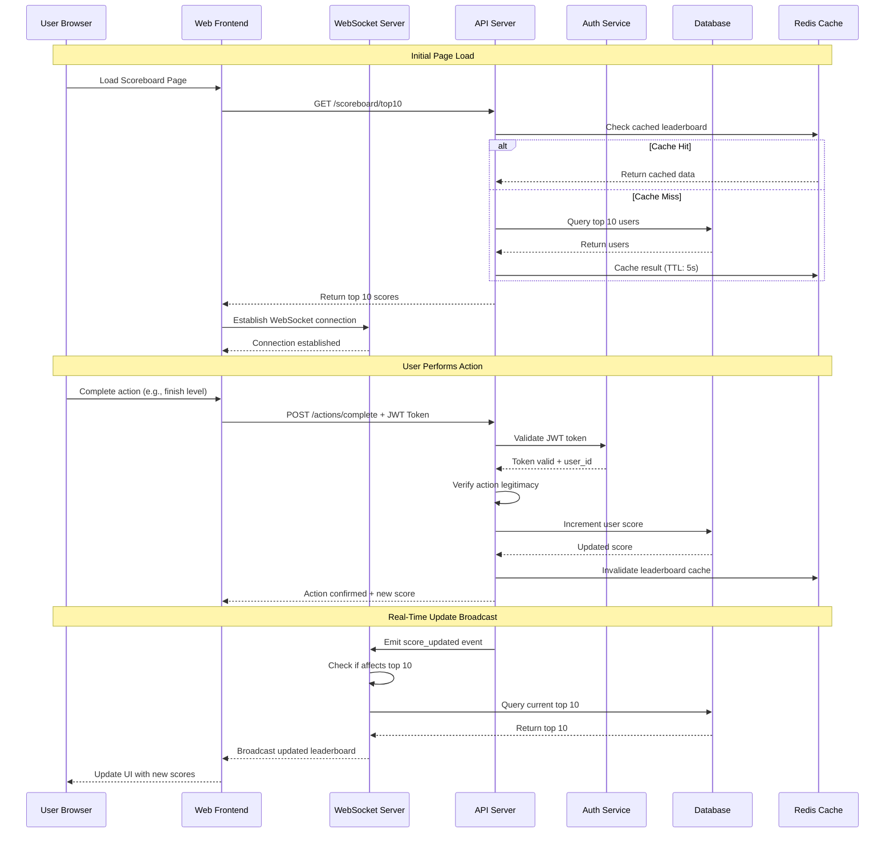

# Problem 6: Real-Time Scoreboard System Architecture

## Table of Contents

1. [System Overview](#system-overview)
2. [Architecture Diagram](#architecture-diagram)
3. [API Specification](#api-specification)
4. [Security Design](#security-design)
5. [Data Models](#data-models)
6. [Real-Time Updates](#real-time-updates)
7. [Scalability Considerations](#scalability-considerations)
8. [Implementation Recommendations](#implementation-recommendations)

---

## System Overview

A real-time scoreboard system that displays the top 10 users and their scores. When users complete actions, their scores are updated via secure API calls, and changes are reflected live on the scoreboard.

### Key Requirements

- ✅ Display top 10 users with scores
- ✅ Real-time score updates (live)
- ✅ Secure score increment via API
- ✅ Prevent unauthorized score manipulation
- ✅ Action-based score system

---

## Architecture Diagram

### System Components Flow

- Please use the https://www.mermaidchart.com for visualize it.



### High-Level Architecture

```
┌─────────────────────────────────────────────────────────────┐
│                        Client Layer                         │
│                    ┌──────────────┐                         │
│                    │   Web App    │                         │
│                    │  (React/Vue) │                         │
│                    └──────┬───────┘                         │
└───────────────────────────┼─────────────────────────────────┘
                            │
                            │ HTTPS + JWT
                            │
┌───────────────────────────┼─────────────────────────────────┐
│                           │                                 │
│         ┌─────────────────▼────────────────┐                │
│         │   Load Balancer (NGINX)          │                │
│         └─────────────────┬────────────────┘                │
│                           │                                 │
│         ┌─────────────────┴────────────────────┐            │
│         │                                      │            │
│  ┌──────▼──────┐  WebSocket     ┌──────────────▼────────┐   │
│  │  WebSocket  │◄──────────────►│   API Server Cluster  │   │
│  │   Server    │   (Internal)   │   (Node.js/Express)   │   │
│  │  (Socket.io)│                │   - Auth Middleware   │   │
│  └─────────────┘                │   - Rate Limiting     │   │
│                                 │   - Action Validator  │   │
│                                 └────────────┬──────────┘   │
│                        Application Layer     │              │
└──────────────────────────────────────────────┼──────────────┘
                                               │
┌──────────────────────────────────────────────┼───────────────┐
│                     Data Layer               │               │
│                                              │               │
│  ┌────────────────┐    ┌──────────────┐    ┌─▼───────────┐   │
│  │  Redis Cache   │    │  PostgreSQL  │    │  Auth DB    │   │
│  │  - Leaderboard │◄───┤  - User Data │    │ (Separate)  │   │
│  │  - Rate Limits │    │  - Scores    │    └─────────────┘   │
│  │  - Sessions    │    │  - Actions   │                      │
│  └────────────────┘    └──────────────┘                      │
│                                                              │
└──────────────────────────────────────────────────────────────┘
```

---

## API Specification

### Base URL

```
https://api.example.com/v1
```

### Authentication

All API endpoints (except public scoreboard) require JWT authentication via `Authorization: Bearer <token>` header.

---

### Endpoints

#### 1. Get Top 10 Scoreboard (Public)

**GET** `/scoreboard/top10`

Retrieve the current top 10 users and their scores.

**Query Parameters:**

- None

**Response:**

```json
{
  "success": true,
  "timestamp": "2024-11-13T12:00:00Z",
  "data": {
    "leaderboard": [
      {
        "rank": 1,
        "userId": "user123",
        "username": "alice",
        "score": 15420,
        "avatar": "https://cdn.example.com/avatars/alice.jpg",
        "lastUpdated": "2024-11-13T11:58:30Z"
      },
      {
        "rank": 2,
        "userId": "user456",
        "username": "bob",
        "score": 14850,
        "avatar": "https://cdn.example.com/avatars/bob.jpg",
        "lastUpdated": "2024-11-13T11:55:20Z"
      }
      // ... 8 more entries
    ]
  }
}
```

**Caching:** Cached for 5 seconds to reduce database load.

---

#### 2. Complete Action (Authenticated)

**POST** `/actions/complete`

Submit an action completion to increment user score.

**Headers:**

```
Authorization: Bearer <JWT_TOKEN>
Content-Type: application/json
```

**Request Body:**

```json
{
  "actionId": "level_5_complete",
  "metadata": {
    "startTime": "2024-11-13T11:55:00Z",
    "endTime": "2024-11-13T12:00:00Z",
    "actionHash": "sha256_hash_of_action_data"
  }
}
```

**Response:**

```json
{
  "success": true,
  "data": {
    "scoreIncrement": 100,
    "newTotalScore": 5350,
    "currentRank": 12,
    "message": "Action completed successfully!"
  }
}
```

**Security Validations:**

1. JWT token validation
2. Action legitimacy check (e.g., user hasn't already completed this action)
3. Action hash verification
4. Rate limiting (max 10 actions per minute per user)
5. Timing validation (action duration must be realistic)

---

#### 3. Get User Score (Authenticated)

**GET** `/users/me/score`

Get current user's score and rank.

**Headers:**

```
Authorization: Bearer <JWT_TOKEN>
```

**Response:**

```json
{
  "success": true,
  "data": {
    "userId": "user789",
    "username": "charlie",
    "score": 8430,
    "rank": 25,
    "scoreHistory": [
      {
        "timestamp": "2024-11-13T11:00:00Z",
        "increment": 50,
        "action": "level_3_complete"
      }
    ]
  }
}
```

---

#### 4. Get User's Action History (Authenticated)

**GET** `/users/me/actions`

Retrieve user's completed actions.

**Query Parameters:**

- `limit` (optional): Number of results (default: 20, max: 100)
- `offset` (optional): Pagination offset

**Headers:**

```
Authorization: Bearer <JWT_TOKEN>
```

**Response:**

```json
{
  "success": true,
  "data": {
    "total": 45,
    "actions": [
      {
        "actionId": "level_5_complete",
        "completedAt": "2024-11-13T12:00:00Z",
        "scoreEarned": 100,
        "verified": true
      }
    ]
  }
}
```

---

#### 5. WebSocket Events

**Connection:**

```javascript
const socket = io("wss://api.example.com", {
  auth: {
    token: JWT_TOKEN,
  },
});
```

**Events:**

**Server → Client: `scoreboard_updated`**

```json
{
  "event": "scoreboard_updated",
  "data": {
    "leaderboard": [
      /* top 10 array */
    ],
    "timestamp": "2024-11-13T12:00:05Z"
  }
}
```

**Server → Client: `user_rank_changed`**

```json
{
  "event": "user_rank_changed",
  "data": {
    "userId": "user789",
    "oldRank": 25,
    "newRank": 23,
    "score": 8500
  }
}
```

---

## Security Design

### 1. Authentication & Authorization

**JWT Token Structure:**

```json
{
  "userId": "user123",
  "username": "alice",
  "iat": 1699876800,
  "exp": 1699963200,
  "jti": "unique-token-id"
}
```

**Token Security:**

- Short expiration (24 hours)
- Signed with HS256/RS256
- Stored securely (httpOnly cookies or secure storage)
- Token refresh mechanism

---

### 2. Action Verification System

To prevent cheating and unauthorized score manipulation:

#### a) Action Hash Verification

```javascript
// Client generates action hash
const actionHash = SHA256(
  actionId + userId + startTime + endTime + SECRET_SALT // Client-side obfuscated secret
);
```

**Server validates:**

- Hash matches expected value
- Timing is realistic (e.g., level can't be completed in 1 second)
- Action hasn't been submitted before (idempotency check)

#### b) Server-Side Action State Tracking

```javascript
// Track user's game state server-side
{
  "userId": "user123",
  "currentLevel": 5,
  "completedActions": ["level_1", "level_2", "level_3", "level_4"],
  "sessionId": "session_xyz",
  "lastActionTime": "2024-11-13T11:55:00Z"
}
```

**Validations:**

- User can only complete actions they're eligible for
- Sequential progression (can't complete level 10 without completing level 5)
- No duplicate completions

#### c) Rate Limiting

**Per User:**

- 10 action submissions per minute
- 100 action submissions per hour

**Implementation:**

```javascript
// Using Redis
const key = `rate_limit:${userId}`;
const count = await redis.incr(key);
if (count === 1) {
  await redis.expire(key, 60); // 60 seconds
}
if (count > 10) {
  throw new Error("Rate limit exceeded");
}
```

---

### 3. Additional Security Measures

#### a) IP-Based Detection

Track unusual patterns:

- Multiple accounts from same IP
- Rapid action submissions
- Impossible action sequences

#### b) Captcha/Challenge for Suspicious Activity

```javascript
if (suspiciousActivity) {
  return {
    success: false,
    requireCaptcha: true,
    challengeId: "challenge_123",
  };
}
```

#### c) Score Freeze & Manual Review

Automatically flag accounts with:

- Sudden score spikes
- Impossible completion times
- Abnormal action patterns

#### d) Audit Logging

Log all score-changing events:

```json
{
  "timestamp": "2024-11-13T12:00:00Z",
  "userId": "user123",
  "action": "score_increment",
  "amount": 100,
  "actionId": "level_5_complete",
  "ipAddress": "192.168.1.1",
  "userAgent": "Mozilla/5.0...",
  "requestId": "req_xyz"
}
```

---

## Data Models

### User Schema

```typescript
interface User {
  id: string;
  username: string;
  email: string;
  passwordHash: string;
  score: number;
  rank: number;
  avatar: string;
  createdAt: Date;
  updatedAt: Date;
  isBanned: boolean;
  flags: {
    suspicious: boolean;
    reviewRequired: boolean;
  };
}
```

### Action Schema

```typescript
interface Action {
  id: string;
  userId: string;
  actionId: string;
  scoreEarned: number;
  completedAt: Date;
  metadata: {
    startTime: Date;
    endTime: Date;
    duration: number;
    actionHash: string;
    ipAddress: string;
  };
  verified: boolean;
}
```

### Scoreboard Cache Schema (Redis)

```typescript
interface LeaderboardEntry {
  userId: string;
  username: string;
  score: number;
  rank: number;
  avatar: string;
  lastUpdated: Date;
}

// Stored as Redis Sorted Set
// Key: "leaderboard:global"
// Score: user's score
// Member: JSON.stringify(LeaderboardEntry)
```

---

## Real-Time Updates

### Strategy: Hybrid Push/Poll

**WebSocket for Active Users:**

- Users viewing the scoreboard maintain WebSocket connection
- Server pushes updates when top 10 changes
- Connection authenticated with JWT

**Polling Fallback:**

- If WebSocket unavailable, poll every 10 seconds
- Graceful degradation for older browsers

### Update Logic

```javascript
// After score update
async function updateScoreboard(userId, newScore) {
  // 1. Update database
  await db.updateUserScore(userId, newScore);

  // 2. Invalidate cache
  await redis.del("leaderboard:global");

  // 3. Check if top 10 affected
  const currentTop10 = await getTop10();
  const wasInTop10 = previousTop10.some((u) => u.userId === userId);
  const isInTop10 = currentTop10.some((u) => u.userId === userId);

  // 4. Broadcast if top 10 changed
  if (wasInTop10 || isInTop10) {
    io.emit("scoreboard_updated", {
      leaderboard: currentTop10,
      timestamp: new Date(),
    });
  }

  // 5. Notify user of rank change
  const newRank = await getUserRank(userId);
  io.to(userId).emit("user_rank_changed", {
    userId,
    oldRank: previousRank,
    newRank,
    score: newScore,
  });
}
```

---

## Scalability Considerations

### 1. Database Optimization

**Indexing:**

```sql
CREATE INDEX idx_users_score ON users(score DESC);
CREATE INDEX idx_actions_user_id ON actions(userId);
CREATE INDEX idx_actions_completed_at ON actions(completedAt DESC);
```

**Read Replicas:**

- Master for writes (score updates)
- Read replicas for scoreboard queries
- Reduces load on primary database

### 2. Caching Strategy

**Multi-Level Cache:**

```
Level 1: In-Memory (Application) - 1s TTL
Level 2: Redis - 5s TTL
Level 3: Database
```

**Cache Invalidation:**

- Invalidate on score update
- Proactive cache warming for top 100

### 3. Horizontal Scaling

**API Server Cluster:**

- Multiple API server instances behind load balancer
- Stateless design (state in Redis/DB)
- Session affinity for WebSocket connections

**WebSocket Scaling:**

```
User A ──┐
User B ──┼──► WS Server 1 ──┐
User C ──┘                  │
                            ▼
User D ──┐              Redis Pub/Sub
User E ──┼──► WS Server 2 ──┤
User F ──┘                  │
                            ▼
User G ──┐              All servers
User H ──┼──► WS Server 3   receive
User I ──┘                  events
```

### 4. Rate Limiting at Scale

**Distributed Rate Limiting:**

```javascript
// Using Redis for distributed rate limiting
const rateLimiter = new RedisRateLimiter({
  points: 10, // Number of requests
  duration: 60, // Per 60 seconds
  blockDuration: 300, // Block for 5 minutes if exceeded
});
```

### 5. Content Delivery Network (CDN)

- Static assets (avatars, images) served via CDN
- Edge caching for scoreboard API (5s TTL)
- Geographic distribution for global audience

---

## Implementation Recommendations

### Technology Stack

**Backend:**

- **API Server:** Node.js with Express/NestJS
- **WebSocket:** Socket.io or native WebSocket with sticky sessions
- **Database:** PostgreSQL (relational) or MongoDB (NoSQL)
- **Cache:** Redis (in-memory)
- **Message Queue:** RabbitMQ or Redis Pub/Sub

**Frontend:**

- **Framework:** React/Vue
- **WebSocket Client:** Socket.io-client or native WebSocket
- **State Management:** Redux/Pinia

**DevOps:**

- **Containerization:** Docker
- **Orchestration:** Kubernetes
- **Load Balancer:** NGINX or AWS ELB
- **Monitoring:** Prometheus + Grafana
- **Logging:** ELK Stack (Elasticsearch, Logstash, Kibana)

### Development Phases

**Phase 1: MVP (2 weeks)**

- Basic API server with CRUD
- PostgreSQL database
- Simple JWT authentication
- Top 10 scoreboard endpoint
- Action completion endpoint
- Basic validation

**Phase 2: Real-Time (1 week)**

- WebSocket server setup
- Real-time scoreboard updates
- Redis caching layer
- Optimized queries

**Phase 3: Security (1 week)**

- Advanced action verification
- Rate limiting
- Audit logging
- IP-based detection
- Admin review system

**Phase 4: Scale (1 week)**

- Load balancer setup
- Database read replicas
- Redis cluster
- CDN integration
- Performance testing

### Testing Strategy

**Unit Tests:**

- Action verification logic
- Score calculation
- Rate limiting

**Integration Tests:**

- API endpoints
- Database operations
- Cache invalidation

**Load Tests:**

- Concurrent users: 10,000+
- Actions per second: 1,000+
- WebSocket connections: 5,000+

**Security Tests:**

- Penetration testing
- SQL injection prevention
- XSS prevention
- CSRF protection

---

## Monitoring & Alerts

### Key Metrics

**Performance:**

- API response time (p50, p95, p99)
- Database query time
- Cache hit rate
- WebSocket connection count

**Security:**

- Failed authentication attempts
- Rate limit violations
- Suspicious action patterns
- Banned user attempts

**Business:**

- Active users
- Actions completed per hour
- Top 10 score changes
- User engagement rate

### Alerting Rules

```yaml
alerts:
  - name: HighAPILatency
    condition: p95_response_time > 500ms
    action: notify_engineering

  - name: SuspiciousActivity
    condition: failed_auth_attempts > 100 per minute
    action: auto_block_ip

  - name: DatabaseDown
    condition: db_connection_failed
    action: page_oncall
```

---

## Conclusion

This architecture provides a secure, scalable, and real-time scoreboard system that prevents unauthorized score manipulation while maintaining excellent performance for thousands of concurrent users.

**Key Security Features:**

- JWT authentication
- Action hash verification
- Rate limiting
- Server-side state tracking
- Audit logging

**Key Performance Features:**

- Multi-level caching
- WebSocket real-time updates
- Horizontal scalability
- Database optimization
- CDN integration

The system is designed to grow with your application and can handle millions of users with proper infrastructure scaling.
